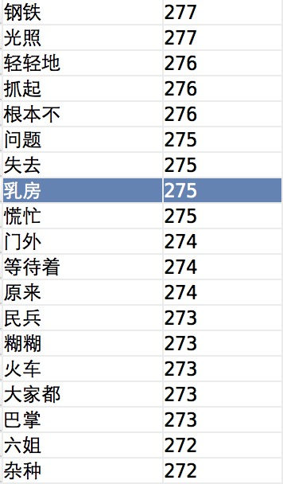

# spark_splitter

spark处理大规模语料库统计词频。代码实现参考[wordmaker](https://github.com/jannson/wordmaker)项目，有兴趣的可以看一下，此项目用到了不少很tricky的技巧提升性能，单纯只想看懂源代码可以参考wordmaker作者的一份[简单版](https://github.com/jannson/yaha/blob/master/extra/segword.cpp)代码。

这个项目统计语料库的结果和执行速度都还不错，但缺点也很明显，只能处理GBK编码的文档，而且不能分布式运行，刚好最近在接触spark，所以用python实现了里面的算法，使之能处理更大规模的语料库，并且同时支持GBK和UTF8两种编码格式。

## 分词原理

wordmaker提供了一个统计大规模语料库词汇的算法，和结巴分词的原理不同，它不依赖已经统计好的词库或者隐马尔可夫模型，但是同样能得到不错的统计结果。原作者的文档提到是用多个线程独立计算各个文本块的词的信息，再按词的顺序分段合并，再计算各个段的字可能组成词的概率、左右熵，得到词语输出。下面就详细的讲解各个步骤：

1. 读取文本，去掉文本中的换行、空格、标点，将语料库分解成一条一条只包含汉字的句子。
2. 将上一步中的所有句子切分成各种长度的词，并统计所有词出现的次数。此处的切分只是把所有出现的可能都列出来，举个例子，天气真好 就可以切分为：天 天气 天气真 天气真好 气 气真 气真好 真 真好 好。不过为了省略一些没有必要的计算工作，此处设置了一个词汇长度限制。
3. 针对上面切分出来的词汇，为了筛掉出那些多个词汇连接在一起的情况，会进一步计算这个词分词的结果，例如 月亮星星中的月亮和星星这两个词汇在步骤二得到的词汇中频率非常高，则认为月亮星星不是一个单独的词汇，需要被剔除掉。
4. 为了进一步剔除错误切分的词汇，此处用到了[信息熵](http://www.baike.com/wiki/%E4%BF%A1%E6%81%AF%E7%86%B5)的概念。举例：邯郸，邯字右边只有郸字一种组合，所以邯的右熵为0，这样切分就是错误的。因为汉字词语中汉字的关系比较紧密，如果把一个词切分开来，则他们的熵势必会小，只需要取一个合适的阈值过滤掉这种错误切分即可。


## 代码解释

原始的C++代码挺长，但是用python改写之后很少，上文中的123步用spark实现非常简单，代码在split函数中，如下：

```python
def split(self):
    """spark处理"""
    raw_rdd = self.sc.textFile(self.corpus_path)

    utf_rdd = raw_rdd.map(lambda line: str_decode(line))
    hanzi_rdd = utf_rdd.flatMap(lambda line: extract_hanzi(line))

    raw_phrase_rdd = hanzi_rdd.flatMap(lambda sentence: cut_sentence(sentence))

    phrase_rdd = raw_phrase_rdd.reduceByKey(lambda x, y: x + y)
    phrase_dict_map = dict(phrase_rdd.collect())
    total_count = 0
    for _, freq in phrase_dict_map.iteritems():
        total_count += freq

    def _filter(pair):
        phrase, frequency = pair
        max_ff = 0
        for i in xrange(1, len(phrase)):
            left = phrase[:i]
            right = phrase[i:]
            left_f = phrase_dict_map.get(left, 0)
            right_f = phrase_dict_map.get(right, 0)
            max_ff = max(left_f * right_f, max_ff)
        return total_count * frequency / max_ff > 100.0

    target_phrase_rdd = phrase_rdd.filter(lambda x: len(x[0]) >= 2 and x[1] >= 3)
    result_phrase_rdd = target_phrase_rdd.filter(lambda x: _filter(x))
    self.result_phrase_set = set(result_phrase_rdd.keys().collect())
    self.phrase_dict_map = {key: PhraseInfo(val) for key, val in phrase_dict_map.iteritems()}
```
第三部过滤后的结果已经相对较小，可以直接取出放入内存中，再计算熵过滤，在split中执行```target_phrase_rdd.filter(lambda x: _filter(x))```过滤的时候可以phrase_dict_map做成spark中的广播变量，提升分布式计算的效率，因为只有一台机器，所以就没有这样做。

## 分词结果

进入spark_splitter/splitter目录，执行命令```PYTHONPATH=. spark-submit spark.py```处理test/moyan.txt文本，只是莫言全集，统计完成的结果在out.txt中，统计部分的结果如下：



(我也不知道为什么这个词这么多)

## 问题分析

1. 上述的算法不能去掉连词，结果中会出现很多类似于轻轻地 等待着这种词
2. 
